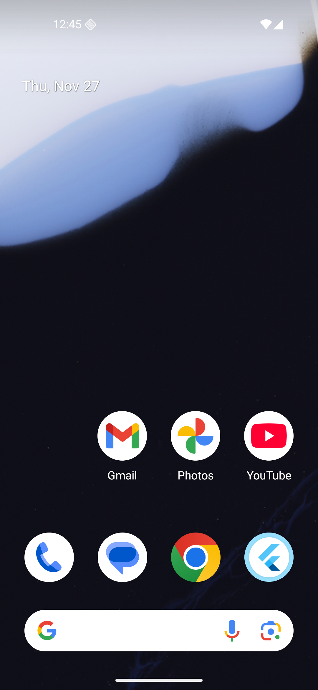

# 🚀 TeamPulse

A Flutter based app built for GDG campus chapters to manage teams, meetings, and attendance with a clean workflow and strict role based access.

---

## 📌 Overview

TeamPulse helps chapters stay organized by giving Chapter Leads and Team Leads the tools they need to run teams smoothly. Members get a simple view of meetings and attendance, while leads get full control over management actions.

---

## ✨ Features

### 🔐 Role Based Access Control

Roles include Super Admin (optional), Chapter Lead, Team Lead, and Member. Each role has its own permissions, ensuring secure and organized management across chapters.

### 👥 Team and Member Management

Chapter Leads can create teams, assign Team Leads, and manage members. It keeps the chapter structure transparent and easy to maintain.

### 📅 Meeting Management

Team Leads can schedule meetings by selecting date, time, and topic. Members get notified when new meetings are created.

### 📝 Attendance Module

Supports Present, Absent, and Late statuses. Duplicate attendance entries are blocked, ensuring clean and reliable data.

### 📊 Analytics and Tracking

Chapter Leads get chapter level attendance insights. Team Leads see team specific data, and members can view their personal attendance history.

---

## 🛠️ Tech Stack

| Layer                | Technology                          |
| -------------------- | ----------------------------------- |
| **Frontend**         | Flutter (Dart)                      |
| **Architecture**     | Clean Architecture                  |
| **State Management** | Provider or GetX                    |
| **Backend**          | Firebase (Auth, Firestore, Storage) |
| **Security**         | Firestore rules for RBAC            |
| **Local Caching**    | Hive                                |

---

## 🗂️ Data Models

| Model          | Key Fields                             |
| -------------- | -------------------------------------- |
| **User**       | id, name, role, chapterId              |
| **Team**       | id, chapterId, name, leadId, members[] |
| **Meeting**    | id, teamId, topic, date, time, leadId  |
| **Attendance** | id, meetingId, memberId, status        |

---

## 📱 Screenshots
### Login

Add your app screenshots here:

```
/assets/screenshots/
  - login.png
  - dashboard.png
  - meetings.png
  - attendance.png
  - analytics.png
```

---

## 🚧 Installation

### 1. Clone the repository

```bash
git clone https://github.com/your-username/TeamPulse.git
cd TeamPulse
```

### 2. Install dependencies

```bash
flutter pub get
```

### 3. Configure Firebase

Add your Firebase `google-services.json` and `GoogleService-Info.plist` files to the required directories.

### 4. Run the app

```bash
flutter run
```

---


